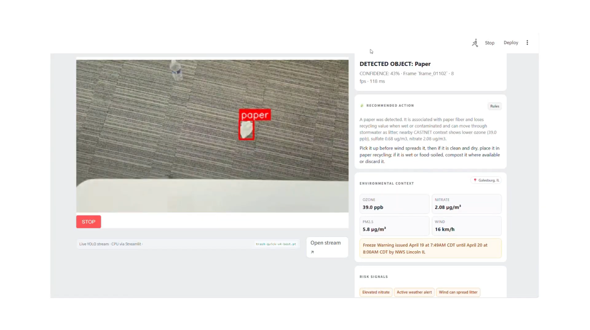

# Aeris

[](https://github.com/LambSystems/aeris/actions/workflows/ci.yml)

Aeris is a real-time environmental intelligence system built for HackAugie, where it won Best Data Insight. It detects visible waste, normalizes local environmental context, and returns a practical sustainability recommendation that still works when LLM providers are unavailable.

**🏆 Winner: HackAugie Best Data Insight**

Aeris is not production recycling infrastructure. The portfolio signal is the system design: a clear boundary between vision detections, environmental context, LLM-backed advice, deterministic fallback behavior, and cache-aware backend orchestration.

- Hackaton Submission: [Devpost](https://devpost.com/software/aeris-the-environmental-intelligence-system)
- Demo video: [Youtube](https://www.youtube.com/watch?v=41eoB-4JUbs)
- Architecture: [docs/architecture.md](docs/architecture.md)
- Local dev setup: [docs/local-dev-setup.md](docs/local-dev-setup.md)
- License: [MIT](LICENSE)



## Review Paths

| If you are... | Start here |
| --- | --- |
| A recruiter or portfolio reviewer | This README, the demo video, and [docs/system-audit.md](docs/system-audit.md) |
| An engineer reviewing the system | [docs/architecture.md](docs/architecture.md), [docs/yolo-integration.md](docs/yolo-integration.md), and [tests/](tests/) |
| Trying to run it locally | `powershell -ExecutionPolicy Bypass -File .\scripts\dev.ps1`, then [docs/local-dev-setup.md](docs/local-dev-setup.md) |
| Looking for model training context | [docs/trash-model.md](docs/trash-model.md) and `backend/scripts/` |
| Looking for hackathon provenance | [docs/hackathon-context.md](docs/hackathon-context.md) and `archive/legacy-ui/` |

## What It Does

Aeris answers one live question:

```text
What is this object, what local context matters, and what should someone do right now?
```

The current project-ready flow is:

```text
Camera or uploaded clip
  -> Streamlit WebRTC / upload processor
  -> local YOLO waste detector
  -> latest structured detection
  -> FastAPI environmental context layer
  -> Gemini or Anthropic advice
  -> deterministic fallback and cache
  -> sustainability recommendation in the UI
```

The custom detector focuses on:

- can
- paper
- bottle

The environmental context layer combines:

- CASTNET processed readings
- Open-Meteo weather
- Open-Meteo air quality
- weather.gov alerts
- derived risk flags

## Deterministic vs AI-Assisted

- Deterministic: environmental context normalization, risk flags, API contracts, cache behavior, and fallback recommendation policy.
- Model-based: YOLO waste detection for cans, paper, and bottles.
- AI-assisted: Gemini or Anthropic recommendation wording when provider keys are configured.
- Bounded: the LLM does not own object detection, environmental measurements, risk flags, or fallback behavior.

## System Boundary

Aeris is intentionally split into three boundaries:

| Boundary | Owner | Responsibility |
| --- | --- | --- |
| Vision layer | Streamlit + YOLO | Camera/video capture, inference, bounding boxes, latest detection |
| Context layer | FastAPI backend | Normalize CASTNET, weather, air quality, alerts, and risk flags |
| Recommendation layer | FastAPI + LLM/fallback | Turn detection + context into grounded action with cache and fallback |

The important engineering choice is that raw video is not sent to the reasoning layer. The recommendation path receives structured detections and environmental context, which keeps the pipeline debuggable and avoids calling an LLM on every frame.

## Repository Map

```text
backend/
  app/main.py                         FastAPI routes
  app/context/                        CASTNET/weather/air-quality context
  app/sustainability/adviser.py       Gemini/Anthropic/fallback advice cache
  app/cv/yolo_service.py              Image scan service path
  streamlit_app.py                    Primary live scanner and upload UI
  scripts/                            YOLO training, realtime, and dataset utilities

ui/
  src/pages/Index.tsx                 Optional React shell / Streamlit embed
  src/components/aeris/               Portfolio UI components
  src/vision/                         Browser/backend YOLO experiments

data/
  castnet/processed/                  Demo CASTNET profiles/readings
  sample_inputs/                      Demo scene fixtures

tests/                                Backend API and policy tests
scripts/                              Root-level backend smoke and data utilities
assets/                               Demo/reference assets

docs/
  architecture.md                     Current system design
  trash-model.md                      Custom model training record
  system-audit.md                     Portfolio-readiness audit

archive/legacy-ui/
  frontend/                           Earlier Vite/React experiment
  aeirs-ui/                           Earlier Next.js experiment
  aeris-ui-scratch/                   Scratch workspace notes only
```

Earlier UI experiments are archived under `archive/legacy-ui/` for provenance. The current maintained UI paths are `backend/streamlit_app.py` and, optionally, `ui/`.

## Quick Start

Install backend/UI dependencies once using [docs/local-dev-setup.md](docs/local-dev-setup.md), then start the local demo from the repo root:

```powershell
powershell -ExecutionPolicy Bypass -File .\scripts\dev.ps1
```

This starts FastAPI at `http://127.0.0.1:8000/docs` and Streamlit at `http://127.0.0.1:8507`. Add `-WithUi` to also start the optional React shell.

Use the root `.env` as the main local configuration file:

```powershell
Copy-Item .env.example .env
```

Aeris works without LLM keys because deterministic fallback advice remains available. The strongest documented checkpoint is `backend/models/trash-quick-v4-best.pt`; it is intentionally gitignored because model artifacts can be large.

## Main API Endpoints

| Endpoint | Purpose |
| --- | --- |
| `GET /health` | Service check |
| `GET /context/fixed` | CASTNET + weather + air quality + risk flags |
| `GET /scan-frame/config` | Current local YOLO settings |
| `POST /scan-frame` | Scan one uploaded image with local YOLO |
| `POST /sustainability/detect` | Build advice for a structured detection |
| `GET /vision/latest-detection` | Latest detection written by Streamlit |
| `POST /analyze-scene` | Older async scene-analysis path |

## Verification

Backend policy smoke tests:

```powershell
powershell -ExecutionPolicy Bypass -File .\scripts\smoke.ps1
```

This includes offline API contract tests for the FastAPI boundary and backend policy tests for event/fallback behavior.

UI tests and build:

```powershell
powershell -ExecutionPolicy Bypass -File .\scripts\smoke.ps1 -WithUi
```

## Hackathon Tradeoffs

- Streamlit remains the primary live scanner because it was the fastest reliable way to connect camera input, YOLO inference, and backend recommendations during the hackathon.
- Model checkpoints are local artifacts and are intentionally gitignored; the documented path is `backend/models/trash-quick-v4-best.pt`.
- Legacy UI experiments are kept under `archive/legacy-ui/` for provenance, but the maintained demo paths are `backend/streamlit_app.py` and `ui/`.
- The recommendation layer favors a small, inspectable fallback path over broad autonomous-agent behavior.

## Team Contributions

- [@postigodev](https://github.com/postigodev): FastAPI layer, environmental context integration, recommendation pipeline, LLM/fallback/cache orchestration, and glue between Streamlit/YOLO detections and the rest of the system.
- [@shuja-waraich-03](https://github.com/shuja-waraich-03): AI integration, real-time synchronization between vision and reasoning, Gemini prompt structure, and live detection validation.
- [@kacytran1122](https://github.com/kacytran1122): Frontend work, React camera detection, landing page, responsive interaction design, and user experience polish.
- [@GALGALLOR](https://github.com/GALGALLOR): Computer vision pipeline, dataset preparation, YOLO fine-tuning, real-time inference performance, and Streamlit integration.


